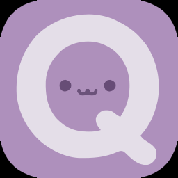
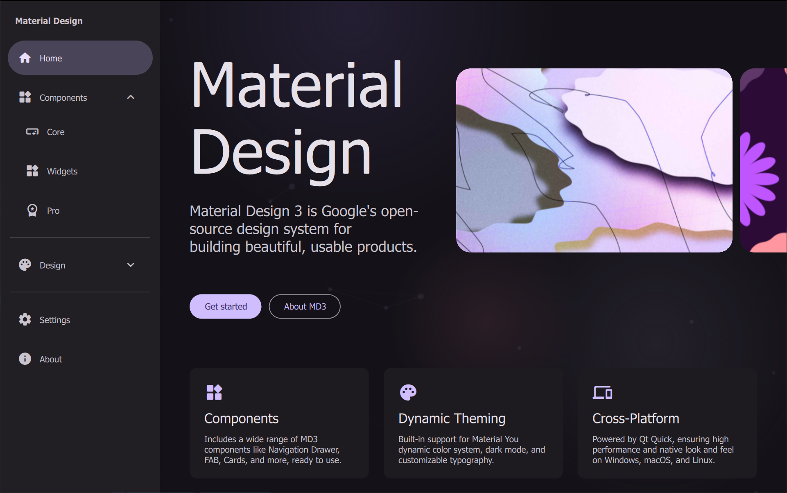
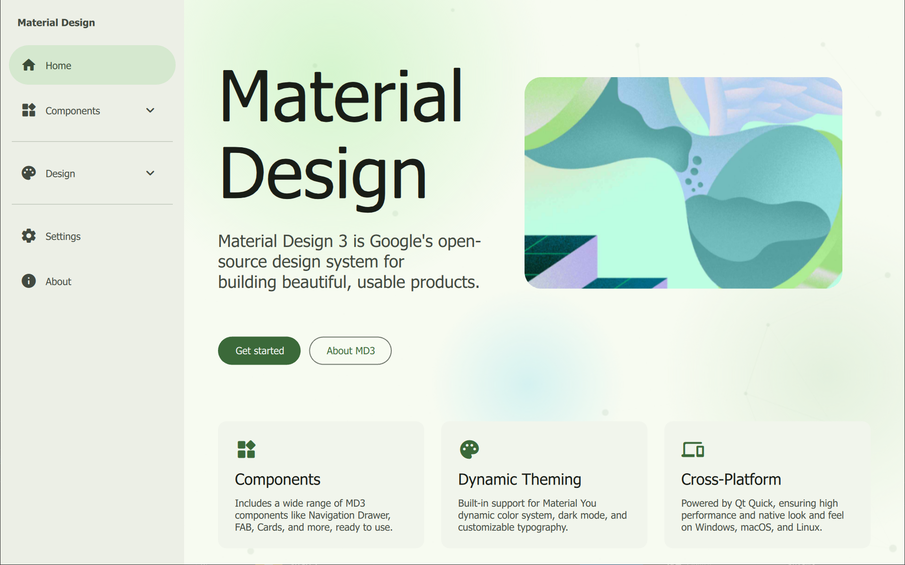
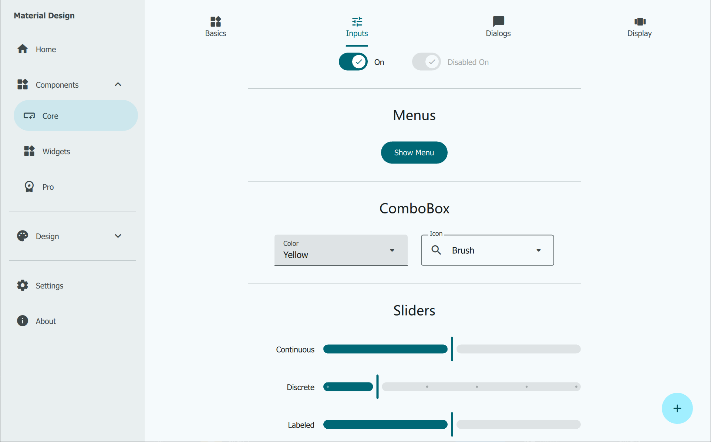
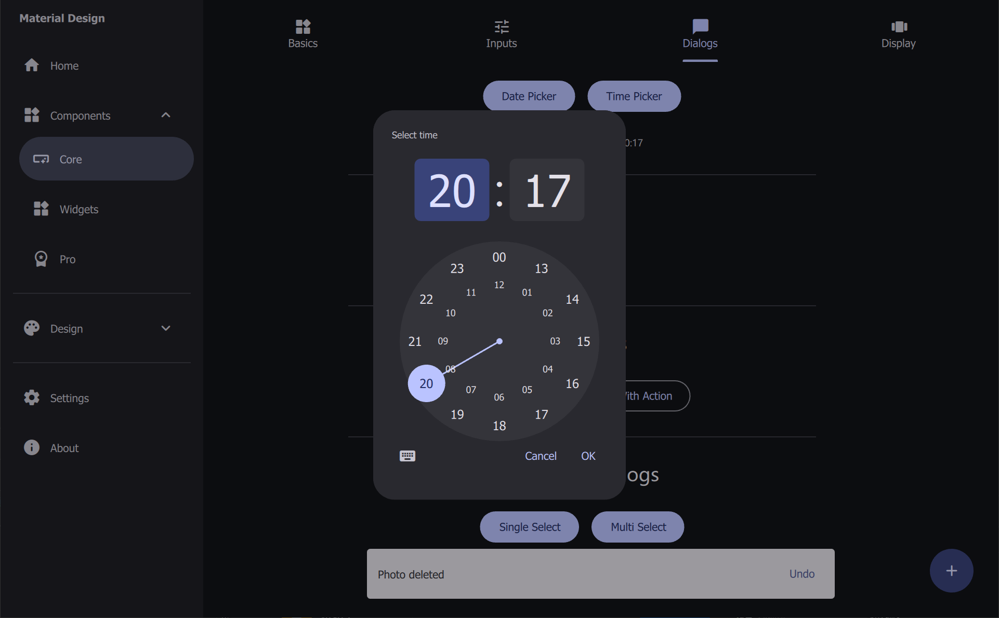
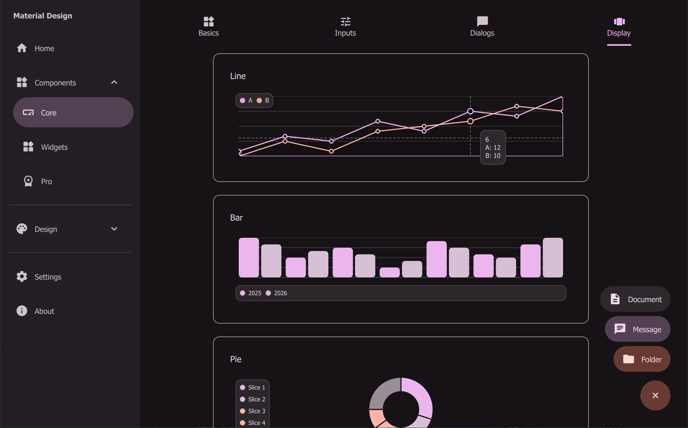
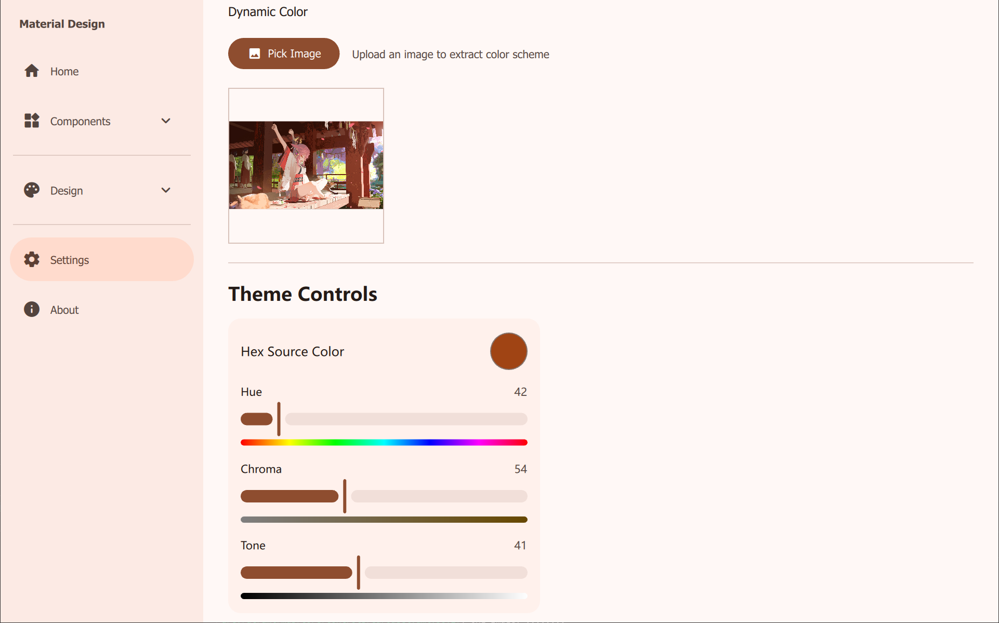

# Material Design 3 for Qt Quick (QML)

<p align="center">
  
</p>

This project implements **Material Design 3 (Material You)** components using Qt Quick (QML) and C++. It aims to provide a comprehensive set of UI components that follow the latest Google Material Design guidelines, complete with dynamic color support, adaptive layouts, and a desktop widget system.

## MD3 Pro (Commercial)

MD3 Pro is built for enterprise-grade desktop apps where performance and developer efficiency matter.

- **Pro Charts**: interactive charts (zoom, pan, crosshair, high-volume data)
- **DataGrid**: enterprise table with virtualization (100k+ rows), sorting/filtering, column operations
- **Hot Reload**: live QML workflow for faster iteration
- **Performance Monitor / Profiler**: in-app performance overlay and diagnostics
- **Commercial License + Priority Support**

Buy / Learn more:
- https://meow2030.github.io/Qtcraft/

## Preview

<table align="center">
  <tr>
    <td></td>
    <td></td>
  </tr>
  <tr>
    <td></td>
    <td></td>
  </tr>
  <tr>
    <td></td>
    <td></td>
  </tr>
</table>

## Features

- **Material Design 3 Components**: A comprehensive library of reusable QML components styled according to MD3 specifications.
- **Dynamic Color System**: Integrated with Google's `material-color-utilities` (C++) to support dynamic color generation from seed colors (Wallpaper-based theming simulation).
- **Desktop Widgets**: A framework for creating and managing standalone desktop widgets (similar to Windows Gadgets or Rainmeter).
- **Theming**: Centralized `Theme` singleton for easy customization of typography, colors, and shapes.
- **Cross-Platform**: Built with Qt 6, supporting Windows, macOS, and Linux.

## Available Components

### Actions & Inputs
- **Buttons**: `Button`, `IconButton`, `FAB`, `SegmentedButton`
- **Selection**: `Checkbox`, `RadioButton`, `Switch`, `Slider`, `ComboBox`
- **Text**: `TextField`
- **Pickers**: `DatePicker`, `TimePicker`, `ColorPicker`

### Navigation
- **Structure**: `NavigationDrawer`, `NavigationBar`, `TopAppBar`, `SideSheet`
- **Wayfinding**: `Tabs`, `Breadcrumb`
- **Menus**: `Menu`

### Display & Feedback
- **Containers**: `Card`, `Carousel`, `Dialog`, `Chip`
- **Status**: `CircularProgress`, `LinearProgress`, `LoadingIndicator`, `ToolTip`
- **Visuals**: `Ripple`
- **Utilities**: `ScrollBar`, `DataTable`

## Project Structure

- `src/Core/`: QML module `md3.Core` (components + Theme system) + C++ backend (`md3Core`).
- `src/App/`: Gallery app `md3.App` (demo pages + desktop widgets) + executable `appmd3`.
- `scaffold/`: PowerShell project scaffold (templates + `New-MD3Project.ps1`).
- `docs/`: Product pages and roadmap (including MD3 Pro roadmap).

## Build & Run

### Prerequisites

- **Qt 6.8** or higher (Required for latest QML features)
- **CMake** 3.16+
- **C++ Compiler** (supporting C++17 or higher)

### Build the Project

1.  **Clone the repository**:
    ```bash
    git clone https://github.com/sudoevolve/material-components-qml.git md3
    cd md3
    ```

2.  **Configure with CMake**:
    ```bash
    cmake -S . -B build -DCMAKE_BUILD_TYPE=Release
    ```

3.  **Build**:
    ```bash
    cmake --build build
    ```

4.  **Run Example**:
    - Single-config generators (Ninja/Makefiles): `build/bin/appmd3` (Windows: `build/bin/appmd3.exe`)
    - Multi-config generators (MSVC): `build/bin/Debug/appmd3.exe` or `build/bin/Release/appmd3.exe`

## Usage in Your Project

The recommended way is to vendor MD3 as source and build `md3Core` together with your app.

### Option: Source Integration (Recommended)

Add MD3 Core to your project:

```cmake
set(MD3_SOURCE_DIR "path/to/md3")

add_subdirectory("${MD3_SOURCE_DIR}/src/Core" md3Core_build)

target_link_libraries(your_app
    PRIVATE
        Qt6::Quick
        md3Core
)
```

### QML Usage

In your QML files, import `md3.Core`:

```qml
import QtQuick
import QtQuick.Window
import md3.Core

Window {
    visible: true
    width: 800
    height: 600
    color: Theme.color.background

    Button {
        text: "Hello MD3"
        anchors.centerIn: parent
    }
}
```

## Desktop Widgets

The gallery app includes a desktop widget manager that can run QML widgets as standalone frameless windows.

- **Manage**: Create, pin, and organize widgets on your desktop.
